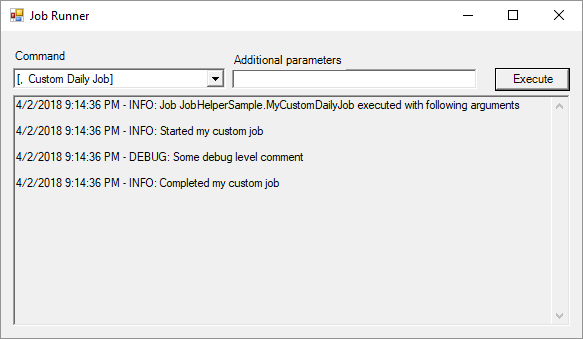

## JobHelper

Job Helper provides a helper class that allows for *easy debugging and setup of jobs* that can be scheduled in a scheduling tool - eg Task Scheduler

### How do I use it?

* Simply download package from nuget
* Have your Job Class implement IJob and you are good to go

### How do I use it?
Run your windows application with following command line switch `/debug` and you get a Job Runner that looks like the following:



Source comes with a sample project with 2 sample jobs configured

### Detailed Configuration Steps Below:

1. Create a Windows Forms App (.NET Framework) project
2. Add a class that will implement your job details - eg MyCustomDailyJob. Really simple interface - only 1 method IJob.Execute(string[] args)
3. Replace your Program.cs with code snippet below. NOTE - Configure Job Switches for each Job you want to run through command line.

```
static class Program
{
	/// <summary>
	/// The main entry point for the application.
	/// </summary>
	[STAThread]
	static void Main(string[] args)
	{
		//To run in GUI - pass /Debug
		//Need help? - pass /Help
		JobRunner.Init(args, GetSwitches());
	}

	public static Dictionary<string, JobSwitch> GetSwitches()
	{
		Dictionary<string, JobSwitch> switches = new Dictionary<string, JobSwitch>();

		//this means passing no arguments will run MyCustomDailyJob
		JobSwitch defaultSwitch = new JobSwitch(String.Empty, "Custom Daily Job", new MyCustomDailyJob());
		switches.Add(defaultSwitch.Switch, defaultSwitch);

		//this means passing argument cleanup will run MyCustomUtilityJob
		JobSwitch anotherSwitch = new JobSwitch("cleanup", "Custom Utility Job - eg Cleanup", new MyCustomUtilityJob());
		switches.Add(anotherSwitch.Switch, anotherSwitch);

		return switches;

	}
}
```

Don't forget to configure log4net debug levels to appropriate levels - see app.config (in sample) or read more on [log4net website](https://logging.apache.org/log4net/release/manual/introduction.html)

